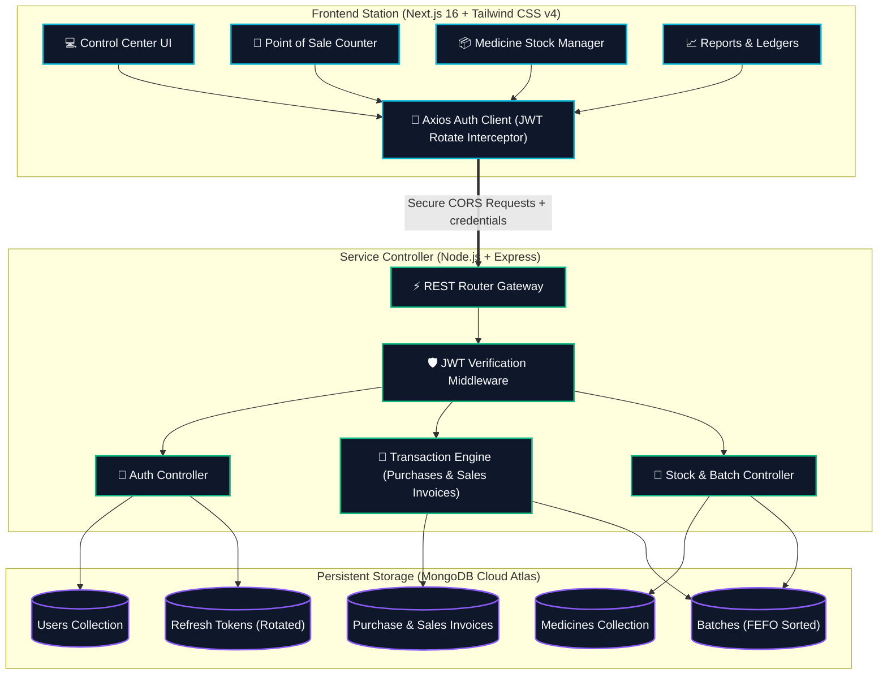
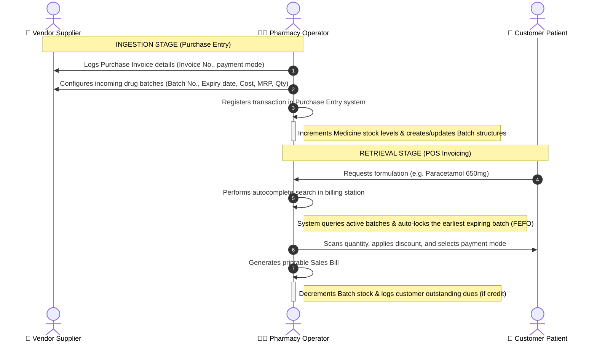

# 💊 PharmaFlow ERP — Smart Pharmacy Inventory & POS System

PharmaFlow is a premium, enterprise-grade Pharmacy ERP and Billing system. It is designed to emulate the robust operational workflows of **Marg ERP** (such as batch tracking, FEFO batch selection, tax invoicing, and ledger balances) but packages it in a stunning, high-tech interface styled with Tailwind CSS v4.

---

## 📊 System Architecture & Data Flow



---

## 🔄 Drug Batch FEFO Ingestion & Billing Lifecycle

PharmaFlow enforces the **First Expiry, First Out (FEFO)** rule. Medicines are sold from the batch that expires earliest to optimize shelf lifecycles and reduce wastage.



---

## 📈 Real-Time Dashboard Analytics (Visual Layout)

The **Control Center Dashboard** aggregates and displays key performance indicators dynamically.

```
┌──────────────────────────────────────────────────────────────────────────────────────────────┐
│  PharmaFlow CONTROL CENTER                                                [ ↻ Refresh ]      │
├───────────────────┬───────────────────┬────────────────────────────┬─────────────────────────┤
│ 🟢 TODAY'S REVENUE│ 🔵 STOCK VALUATION│ 🟡 SAFETY BUFFER ALERTS    │ 🔴 EXPIRED WARNINGS     │
│   ₹42,500.00      │   ₹8,45,200.00    │   3 Items Low Stock        │   2 Batches Expiration  │
├───────────────────┴───────────────────┴────────────────────────────┴─────────────────────────┤
│                                                                                              │
│   REVENUE TREND (Last 7 Days)                                                                │
│   ₹50k ─────────────────────────────────────────────────────────● (Today)                  │
│   ₹40k ──────────────────────────────────────────●                                           │
│   ₹30k ──────────────●──────────────────────────/ \                                          │
│   ₹20k ─────────────/ \────────●───────────────/   \                                         │
│   ₹10k ───●────────/   \──────/ \─────────────/     \                                        │
│     0  ───┴────────┴───┴──────┴───┴───────────┴──────┴───────────                            │
│          Mon      Tue  Wed   Thu  Fri         Sat    Sun                                     │
│                                                                                              │
├──────────────────────────────────────────────┬───────────────────────────────────────────────┤
│  ⚠️ CRITICAL STOCK BUFFER                    │  ⏳ SOON EXPIRING BATCHES (FEFO RETURN)       │
│  • Amoxicillin 250mg (Qty: 2  | Alert: 10)   │  • Calpol 500mg  [Batch: CP-101]   Exp: 08/26  │
│  • Paracetamol 650mg (Qty: 0  | Alert: 20)   │  • Cetirizine 5mg [Batch: CT-902]   Exp: 09/26  │
└──────────────────────────────────────────────┴───────────────────────────────────────────────┘
```

---

## 🛠️ Tech Stack & Key Libraries

### Backend Framework
- **Runtime**: Node.js & TypeScript ES Modules (compiled to `dist/server.js`)
- **Web Server**: Express.js
- **Database Connector**: Mongoose (MongoDB ODM)
- **Security**: JWT (jsonwebtoken), BcryptJS (password hashing)
- **Token Storage**: httpOnly secure cookies with dynamic `sameSite` policies (`lax` for dev, `none` for cloud production cross-domain transfers)

### Frontend Station
- **Framework**: Next.js 16+ (App Router)
- **Style Engine**: Tailwind CSS v4 (native design styles)
- **Data Visualization**: Recharts (smooth SVG Area charts)
- **Icons Hook**: Lucide React
- **Notifications**: React Hot Toast
- **HTTP Engine**: Axios (configured with response interceptors for silent token refresh loops)

---

## 🚀 Deployment Specifications

Detailed settings for deploying this monorepo project:

> [!IMPORTANT]
> **Vercel (Frontend)** and **Render (Backend)** reside on different domain roots. 
> Because of this, authentication cookies are treated as third-party. The codebase is pre-configured to automatically handle this transition:
> - In production (`NODE_ENV=production`), the refresh token cookie is signed with `sameSite: 'none'` and `secure: true`.
> - CORS is configured with `credentials: true` and dynamically reflects the Vercel URL in `origin` configurations.

### Backend Setup (Render Web Service)
- **Root Directory**: `backend`
- **Build Command**: `npm install && npm run build`
- **Start Command**: `npm start`
- **Environment Variables**:
  - `NODE_ENV` = `production`
  - `MONGODB_URI` = `mongodb+srv://...` (Make sure `0.0.0.0/0` is whitelisted in Atlas Network Access)
  - `ACCESS_TOKEN_SECRET` = *(Random long hash)*
  - `REFRESH_TOKEN_SECRET` = *(Random long hash)*
  - `FRONTEND_URL` = `https://your-pharmaflow.vercel.app`

### Frontend Setup (Vercel Project)
- **Root Directory**: `frontend`
- **Framework Preset**: `Next.js`
  

---

## 💻 Running Locally

### 1. Ingest dependencies:
```bash
# In backend directory
cd backend && npm install

# In frontend directory
cd ../frontend && npm install
```

### 2. Configure Local Env:
Create `backend/.env`:
```env
PORT=5000
MONGODB_URI=mongodb://localhost:27017/pharmacy-inventory
ACCESS_TOKEN_SECRET=dev_jwt_secret_access_key_string
REFRESH_TOKEN_SECRET=dev_jwt_secret_refresh_key_string
FRONTEND_URL=http://localhost:3000
NODE_ENV=development
```

### 3. Boot Dev Servers:
Open two terminals to run the backend and frontend simultaneously:
```bash
# Terminal 1 (Backend)
cd backend && npm run dev

# Terminal 2 (Frontend)
cd frontend && npm run dev
```

Open [http://localhost:3000](http://localhost:3000) in your browser to start the app.
